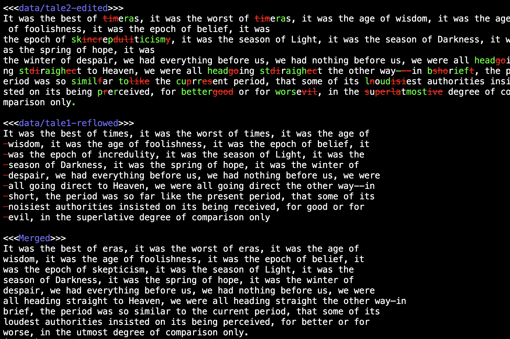

# What is GASPRA

GASPRA is the Generalized Automaton-based String Processing for Rapid Alignment.
GASPRA implements an efficient algorithm to solve the Longest Common
Substring (LCS) problem.  Specifically it uses a suffix automaton, which
is a finite state machine and is extremely efficient at string searching
and matching problems.  It uses the suffix automaton as a base on which
to build diffing and merging tools.  Because it's efficient, it's
able to apply correct merge files viewing them as sequences of characters,
where most traditional merge programs view files as sequences of lines.
Documents with a lot of multi-line text (e.g., markdown files, and LaTex
files, and lengthy comments in source code) confuse line-oriented
merge algorithms, and you end up with a lot of
"conflicts" that don't really exist.  

The line-oriented approach is an order of magnitude faster, and GASPRA
allows you to chose line-oriented or character-oriented merges.  Both 
will use the suffix automaton approach.  It's a matter of whether you
view a text file as a sequence of characters or a sequence of lines.
It's still a sequence of tokens and the suffix automaton approach works
on both cases.

Here's an example of running `gaspra-merge` on three files were the
first had no line breaks, the second was edited (without adding line
breaks), and the third was reflowed.  These files were merged with no
conflicts.  Line-oriented tools show the entire paragraph as a conflict.
The result shown is the output of the command:

```
gaspra-merge -sdc data/tale0 data/tale1-reflowed data/tale2-edited
```



See [Merging](#merging) for another example.


# What's included

* gaspra-diff - A tool for diffing two text files in either a
  line-oriented or a character-oriented fashion.
* gaspra-merge - A tool for doing a 3-way merge in either a
  line-oriented or a character-oriented fashion.

GASPRA has been tested on [Bill Ritcher's set of pathological merge test
cases](https://www.guiffy.com/SureMergeWP.html) and performs quite
well.  In cases where there should have been no conflict, GASPRA
showed no conflict.  When there were conflicts, the GASPRA merges
were reasonably interpretable.  There was one case where 
Guiffy would have drawn attention to a change that was technically
not a conflict.  GASPRA merged it with no warning.  There was also a
case where GASPRA duplicated some code, but GASPRA's merge was arguably
correct.  In all other cases, GASPRA's merges and conflict flags
were very appropriate.

# Why GASPRA exists

Recently, I became interested in string matching. In particular, I was
interested in the LCS problem and related problems. I
discovered that efficient string matching is hard to find, especially in
Python. Much of what you find on the internet is either slow, or in some
cases, simply doesn't work.  I wanted a pure Python solution that is
reasonably fast to experiment with some string matching algorithms.


Though implementations appear uncommon, efficient algorithms exist.
The LCS problem is solvable in linear time, yet most online examples
use a classical dynamic programming approach which is quadratic in
both space and time. Even the venerable `difflib`, which is part of
Python's standard library uses quadratic-time algorithms.
GASPRA uses efficient suffix automata
with linear time and space complexity. The difference is dramatic.
It's the same as the difference between a quicksort and a bubble sort.
Because of this difference, nobody uses a bubble sort, which is
universally recognized as a naive approach.  Yet somehow, using
dynamic programming to solve text matching is widely accepted.
`Difflib` is practically unusable on large, document-length
strings. The table below shows the time to find the LCS in two
strings for `difflib` compared to this package. The strings are
equal-length, random sequences of the letters a, b, and c.
The lengths shown in the table are the combined length of
the two strings.
The quadratic complexity of 'difflib' is obvious.  Even though it's a pure
Python solution, GASPRA is quite fast by comparison.

| Length   |   Match Length |   Difflib (ms) |      GASPRA (ms) |
|----------|----------------|----------------|------------------|
| 2k       |             13 |             31 |                3 |
| 4k       |             13 |            120 |                5 |
| 8k       |             15 |            472 |               11 |
| 16k      |             15 |          1,897 |               32 |
| 32k      |             16 |          7,828 |               52 |
| 64k      |             18 |         33,314 |              121 |
| 128k     |             19 |        135,413 |              341 |
| 256k     |             23 |        554,665 |              690 |

# Installation

You can install GASPRA using `pip` (or similar compatible tools):

```
pip install gaspra
```
# Examples.

## Finding Longest Common Substrings

The function `gaspra.find_lcs()` returns the starting positions and the
length of common substring of two strings with maximal length:

```
>>> import gaspra                                                                                               
>>> a="Call me Ishmael. Some years ago—never mind how long \
precisely—having little or no money in my purse, and nothing \
particular to interest me on shore, I thought I would sail \
about a little and see the watery part of the world"                                                                                                                  
>>> b="It was the best of times, it was the worst of times, \
it was the age of wisdom, it was the age of foolishness, \
it was the epoch of belief, it was the epoch of incredulity, \
it was the season of Light, it was the season of Darkness, \
it was the spring of hope, it was the winter of despair, we \
had everything before us, we had nothing before us, we were \
all going direct to Heaven, we were all going direct the other \
way – in short, the period was so far like the present period, \
that some of its noisiest authorities insisted on its being \
received, for good or for evil, in the superlative degree of \
comparison only."
>>> gaspra.find_lcs(a,b)
(103, 321, 10)
>>> a[103:103+10]
'd nothing '
>>> b[321:321+10]
'd nothing '
```


There's also `find_lcs_multiple()` for n-way common strings:

```
>>> a="The quick brown fox jumps over the lazy dog near the riverbank."
>>> b="The quick brown fox leaps over the lazy dogs near the river."
>>> c="The quick, clever fox jumps across the lazy dogs by the riverbank."
>>> gaspra.find_lcs_multiple(a, b, c)
((30, 30, 34), 13)
>>> a[30:30+13]
' the lazy dog'
```

## Finding Diffs

Given an original string and a modified string, the function
`gaspra.diff()` returns the sequence of changes represented
interspersed with fragments from the original string.  The sequence is
a sequence of strings (fragments from the original) and tuples of two strings
representing an insertion/deletion pair.  Note that an insertion is a tuple
where the deletion string is empty, and vice versa.

```
>>> import gaspra
>>> original="The quick brown fox jumps over the lazy dog near the riverbank."
>>> modified="The quick brown fox leaps over the lazy dogs near the river"
>>> list(gaspra.diff(original, modified))
['The quick brown fox ', ('lea', 'jum'), 'ps over the lazy dog', ('s', ''), ' near the river', ('', 'bank.')]
```

# Merging

Here's an example of two different revisions of the same sentence that can be
resolved without any conflicts.

``` 
>>> original = "The quick brown fox jumps over the lazy dog near the riverbank."
>>> editor1 = "The quick brown fox leaps over the lazy dogs near the river."
>>> editor2 = "The quick, clever fox jumps across the lazy dogs by the riverbank."
>>> list(gaspra.diff(original, editor1))
['The quick brown fox ', ('lea', 'jum'), 'ps over the lazy dog', ('s', ''), ' near the river', ('', 'bank'), '.']
>>> list(gaspra.diff(original, editor2))
['The quick', (',', ''), ' ', ('cleve', 'b'), 'r', ('', 'own'), ' fox jumps ', ('ac', 'ove'), 'r', ('oss', ''), ' the lazy dog', ('s', ''), ' ', ('by', 'near'), ' the riverbank.']
>>> list(gaspra.merge(original, editor1, editor2))
['The quick, clever fox leaps across the lazy dogs by the river.']
```

Here's the same example but with a different revision by editor2 that *does*
conflict with editor1.  The conflicts are represented as a tuple with two
alternate versions of the merged text.

```
>>> conflicts_with_1 = "The swift, agile fox leaps over the sleepy dog near the riverside."
>>> list(gaspra.diff(original, conflicts_with_1))
['The ', ('s', 'quick bro'), 'w', ('ift, agile', 'n'), ' fox ', ('lea', 'jum'), 'ps over the ', ('s', ''), 'l', ('eep', 'az'), 'y dog near the river', ('side', 'bank'), '.']
>>> list(gaspra.merge(original, editor1, conflicts_with_1))
['The swift, agile fox leaps over the sleepy dogs near the river', ('', 'side'), '.']
```

